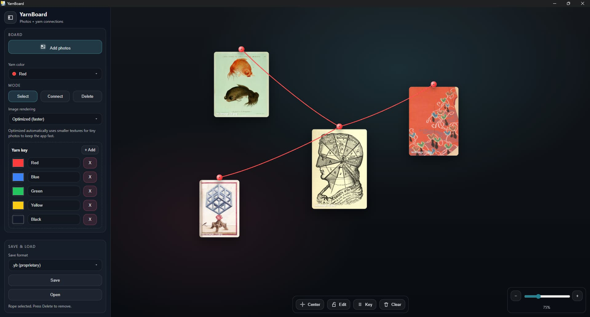

# 🧶 YarnBoard

YarnBoard is a lightweight desktop app for creating **link charts** - visually organizing images and relationships on a board using pins and ropes.


<p align="center">
  
</p>

---

## ✨ Features
- Add and arrange images on a canvas
- Connect items with ropes
- Delete images or connections interactively
- Save and load boards (`.yb`, `.db`)
- Native Windows and Linux builds

---

## 📦 Downloads & Installation

Downloads are available on the  
➡️ **[GitHub Releases page](https://github.com/kor-pixel/YarnBoard/releases)**

### Windows
- Download and run **`YarnBoardSetup.exe`**
- The installer automatically installs required components:
  - Microsoft Edge **WebView2 Runtime**
  - **.NET Desktop Runtime (x64)**

> Use the installer. Running the raw `.exe` is not supported.

### Linux (Debian / Ubuntu) - Currently failing
```bash
sudo apt install ./YarnBoard-<version>-amd64.deb
```

Supported on Ubuntu 22.04+ and compatible Debian-based systems.

---

## 🖥️ System Requirements

### Windows
- Windows 10 / 11 (64-bit)

### Linux
- Debian/Ubuntu-based distro
- GTK 3 + WebKitGTK (installed automatically via `.deb`)

---

## 🧑‍💻 Development

### Tech Stack
- Frontend: TypeScript, HTML, CSS
- Desktop backend: Python 3.11 + pywebview
- Packaging: PyInstaller
- CI: GitHub Actions

### Local Setup (debug)
```bash
git clone https://github.com/kor-pixel/YarnBoard.git
cd YarnBoard

npm ci
npm run build

python -m venv .venv
source .venv/bin/activate   # Windows: .venv\Scripts\activate
pip install -r requirements.txt

PYWEBVIEW_GUI=gtk YARNBOARD_DEBUG=1 python main.py
```

---

## 📁 Project Layout

```text
.github/workflows/    CI pipelines
installer/            Windows installer (Inno Setup)
web/                  Frontend source
main.py               App entry point
requirements.txt      Python deps
package.json          Frontend deps
```

---

## 📄 File Formats
- `.yb` — YarnBoard project file
- `.db` — SQLite-based board storage 

While .yb and .db files currently offer feature parity, the .yb format was introduced to support future extensibility. This custom format provides a foundation for complex features that may not be compatible with the standard .db structure.

---

## 🛠️ Building Releases
- Windows installer and Linux `.deb` packages are built automatically via GitHub Actions.
- See `.github/workflows/` for details.

---

## 🎨 Acknowledgments
* **Public Domain Image Archive** — Special thanks to [PDImageArchive.org](https://pdimagearchive.org/) for the high-quality assets used in this projects demonstration.
* All external assets are used in accordance with their respective licenses.

---

## 📜 License
- MIT 
---

## 🤝 Contributing
Issues and pull requests are welcome.  
